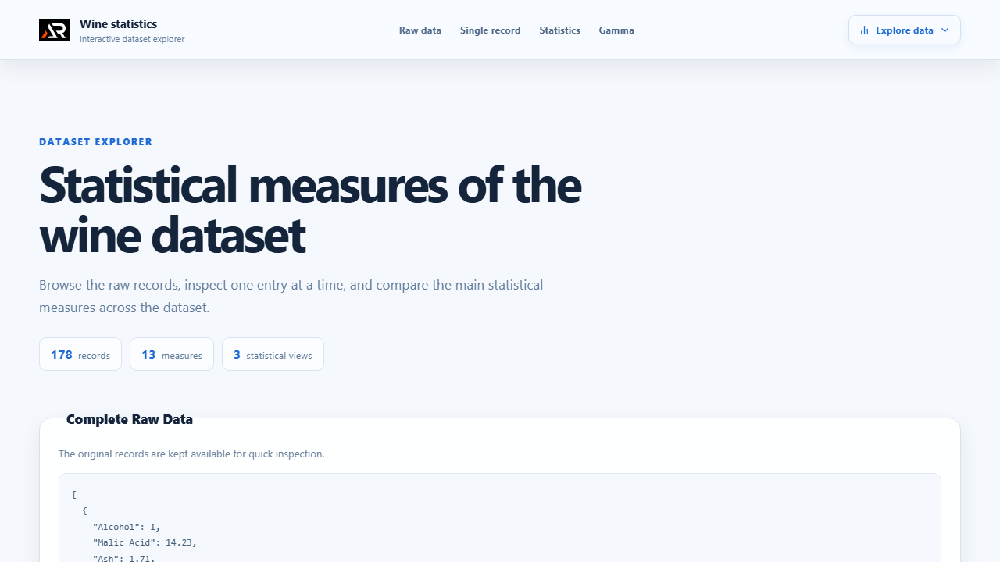

# Wine Statistics Explorer

A React dashboard for exploring a wine dataset through raw records, single-record navigation, and statistical summaries.



## Features

- Browse the complete raw dataset
- Inspect individual records with buttons or keyboard navigation
- Compare minimum, maximum, mean, median, and mode values
- Review calculated Gamma measures
- Responsive layout with accessible navigation and footer links

## Tech stack

- React 18
- Create React App
- Sass modules
- React Icons

## Run locally

```bash
npm install
npm start
```

Create a production build with `npm run build`.

## Live URL

[https://a2rp.github.io/job-project-frontend/](https://a2rp.github.io/job-project-frontend/)

## Future prospects

- Add filters and sorting for individual wine measures
- Add charts for comparing distributions
- Add downloadable summary reports

## Links

- Portfolio: [https://www.ashishranjan.net/](https://www.ashishranjan.net/)
- GitHub: [https://github.com/a2rp](https://github.com/a2rp)
- CodePen: [https://codepen.io/ash1198](https://codepen.io/ash1198)
- LinkedIn: [https://www.linkedin.com/in/aashishranjan](https://www.linkedin.com/in/aashishranjan)
- Facebook: [https://www.facebook.com/theash.ashish/](https://www.facebook.com/theash.ashish/)
- YouTube: [https://www.youtube.com/@ashishranjan-ashz?sub_confirmation=1](https://www.youtube.com/@ashishranjan-ashz?sub_confirmation=1)
- Email: [ash.ranjan09@gmail.com](mailto:ash.ranjan09@gmail.com)

## Support

- Support: [https://a2rp-donation-page.netlify.app/](https://a2rp-donation-page.netlify.app/)
- Buy Me a Coffee: [https://buymeacoffee.com/a2rp](https://buymeacoffee.com/a2rp)
- Patreon: [https://www.patreon.com/a2rp](https://www.patreon.com/a2rp)
